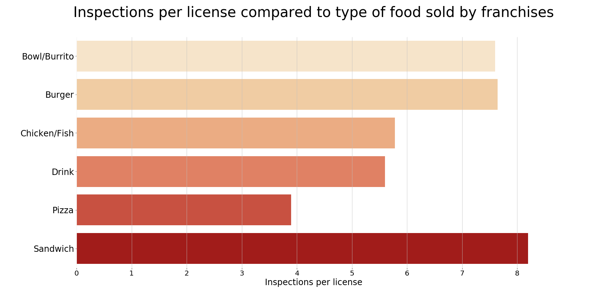
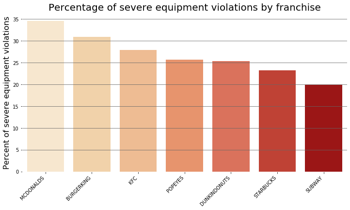

You are Bob, a globe trotter who is travelling through the universe. You had an accident with your spacecraft so you made an emergency landing somewhere on the Earth. You discovers the fifty-star-spangled flags and three-star-spangled flags on street. Being an alien who has some knowledge in different countries and flags on the Earth, you correctly guesses that you are somewhere in Chicago, U.S. "What a relief", you say to yourself, "at least I can read English!"
Suddenly, you feel starvation. You need to find something to eat, somewhere that sells food. Fortunately, you can see a lot of facilities that seems to serve food. But you have no idea which place is safe to go. Bewildered, you ask Adata2 team for help.
"I am starving. Can you tell me which restaurant to visit? All I know is that I am somewhere in Chicago. I don't really care how the food tastes, but I do care for safety."

## Bird's eye view of Chicago restaurants.

To get the ideas of safe restaurants in Chicago, we first need to see how Chicago food inspection works for restaurants in general. How often are restaurants inspections conducted and how many of them pass? What are the main causes of failure? Are there other sociological or geological features that are correlated with certain tendancies?

### Are franchise restaurants safer than individual restaurants?
Roughly, there are two ways of choosing a place to eat. One is eating at a franchise restaurant that is already familiar to you, the other is challenging a restaurant you have never seen before. Which will be the safest action? 
 
Here is quick look at the average number of inspections and inspection pass rate of Chicago restaurants. We classified the restaurants in three groups: massive, worldwide franchises, smaller franchises, and non-franchises. As we can see in the next figure, the average inspections is the highest in big franchise restaurants while smaller franchises were inspectly least frequently.  
  

### The fries or the salad?  
There are different types of food served in franchise restaurants: burgers, sandwiches, pizza.. Can we tell which type of franchise is safer to eat in Chicago? First, let's take a look at the average number of inspection for each type of franchise to see how they behave.  
  
 
Sandwich franchises are the ones being the most inspected with on average 8.1 inspections per restaurant! They are closely followed by burritos/bowls and burgers. This is interesting as those are often mentionned when there are disease outbreaks and thus may have been targeted more thoroughly by inspectors. Opposed to this are pizza places that are inspected twice less inspected. But more importantly, what about the results of those inspections?  
  
 
Seeing from the overall fail rate between different types of franchises, we can say sandwich franchises are the safest, and the pizza franchises are the least safe. Furthermore, the inspection pass rate is heavily correlated with the inspection frequency. We can infer that a restaurant that is inspected more often is likely to take care of safety issues, and eventually, to pass the inspection more easily than its counterparts.  

### Which violations are the main causes of inspection failure?
Before digging the different franchises with the violations they've got, let's take a look into the main cause of inspection failure for major franchise restaurants.
  
Among the violations related to the inspection failure, hygyene issue took more than half of the total violations, followed by equipment. Looking into those two violations througout different types of franchises will give us the detailed idea of which place is safer to visit.

### The violations podium
Few franchises are similar to each other and it gives some interesting results. We have found a few intriguing stats:  
  
Funnily, McDonald's has the highest number of violations related to equipment maintenance/sanitization. A nice find when you know that they were heavily mocked a few months ago on the internet for their always-broken ice machines.  
  
No luck for McDonalds, they are still the best in another category! With BurgerKing, they must have angered a lot of customers to be controlled close to 4 out of 5 times for a complaint.

### Is the Wealthier the safer, wherever you are?

In the previous part, we discovered that the restaurants in wealthier regions tends to be safer. Is this tendency still visible in different groups of restaurants?

For non-franchise restaurants, there is a meaningful positive correlation between regional wealth and regional inspection pass rate. For the others, the correlation is weaker. However, the variance of regional pass rate is higher for smaller franchises. 

To summarize, massive franchise restaurants in Chicago not only had highest inspection rate and pass rate, it also showed relatively consistent pass rate thoughout different regions. To a total alien in Chicago, we will recommend her to visit the franchise that is already familiar to her.

## Then, which franchise should I visit?

# Part Franchise versus Franchise  

## In which franchise should I go to eat?  
Suppose that someone wants to eat in a big franchise for some reason. One can say that maybe it's important to go to a safe place with little risk to contract a disease or something. If we check the rate of failing inspections, we can have an idea of which franchise is the safest.  
### Want to eat a beef burger?  
  
If we're looking at McDonald's, Burger King and Wendy's, we want to choose one of them to have a good American burger. The question is which one to choose? One can say that it depends on the person's preference. Let's answer this question by looking at the safety of each restaurant without taking into account the taste of each burger. In function of the year, the safest restaurant varies a lot but nowadays, Burger King is the best performing. In addition, one can note that since 2015, only Burger King tries to improve in comparison of Wendy's and McDonald whose fail rate still increases.  

### Want to eat some fried chicken?  
  
By selecting KFC,Harold's Chicken and Popeyes, our chicago guy want to choose one of them for his dinner. He doesn't prefer any of them but he wants to be sure that the restaurant is safe because he read an article about [bird flu](http://dbfchicago.com/bird-flu-chicago/) that makes him scared of this disease. Like for the burgers, since 2015, KFC and Popeyes try to stabilize (decrease) their fail rate. In contrast, Harold's Chicken trend to fail more inspections for the two others. Base on that, the chicago guy will have to choose between the [Colonel Sanders](https://en.wikipedia.org/wiki/Colonel_Sanders) restaurant and Popeyes.  
### Want to eat some Pizza?  
  
Finally, what's better than a good pizza in front of the TV ? We have to select one of the following restaurant: Pizza hut,Dominos or Papa John's pizza. By taking into account the plot above, we know that Papa John's pizza  decrease his fail rate ratio through 2015 but, unfortunately, nowadays it's better to goes in Dominos or Pizza Hut to have more safety. At the end, the best of the three restaurant is Pizza Hut who only has 9% of fail rate at present.
 
## Where do I need to go?  

Sometimes, we just don't want to go far away to enjoy a meal. We want to get out of bed, go outside and take a burger at the closest street block without worrying about transportation. We will see in this part that not all districts are equal regarding inspections and their results. Later on, we will focus on some franchises as those also have pretty different results depending on where they are located in Chicago.  

### The socio-economic factor  

Chicago suffers a clear wealth divide with some district being largely poorer than their neighbors. This can be observed with the North and North-East districts that are way richer than the West and South side of Chicago. We used the median household income as a wealth indicator to see if there is a correlation between the wealth and the overall restaurant inspections’ results.
To visualize this, we put side by side the districts’ median income, their average inspections per restaurant (from 2011 to 2017) and the average inspection fail rate of these same restaurants.

   
  
   
We clearly see a domino effect between these different metrics. Especially, lower income districts' restaurants may face fewer inspections. And this lower amount of inspections leads surely to more failures as restaurants are left alone longer without control. So if you want to lunch in a random restaurant within your district with as few sanitation issues as possible, you better live in the wealthiest one!  

### But what if I  prefer <insert_food\> ? 

We got you covered! They are many franchises established in Chicago and all the biggest ones (such as McDonald's, Starbucks, KFC...) are present. But as we may expect, they all behave differently depending on where they are located. We will cover in this subsection which franchises are to be preferred depending on what type of food do you want and where do you want to eat it.  
We split up the franchises in 4 different categories depending on what type of food they are selling: burgers, pizzas, fried chicken and snacks/drinks. Each category only contains the 3 most established franchises as smaller ones tend to have not enough data for to study. 
#### I want: a Burger  
For the burger category, we have McDonald's, Burger King and Wendy's facing themselves. McDonald's has a failing rate greater than 15% on almost all Chicago's territory but has no outliers (the biggest fail rate in only 35%). This differs from Burger King that is much less prone to failing inspections in the North and South of Chicago but has 2 districts in the Middle-North that are close to 50% failing rate. Wendy's follows the same trend except the worst places in the south.
 
  

#### I want: a Pizza  
Pizzas are a little bit different than other franchise types as they are also heavily involved in delivery. Papa Johns Pizza is the black sheep here with more than 25% failed inspections on about 60% of the districts it covers. Dominos and Pizza Hut are the inverse of each other with Dominos being exemplary everywhere except in the middle of Chicago. Pizza Hut is a little bit better on average in the Middle-North but worse than Dominos elsewhere.
 
  

#### I want: Fried Chicken  
There is also a black sheep in fried chicken fast foods: Harold's Chicken Shack. While it covers the vast majority of South Chicago (the poorest region), most of the franchises are failing at least one quarter of the inspections. KFC and Popeyes have are doing well in the South but KFC has the advantage in the North.  
 
  

#### I want: a Snack  
One information that isn't shown in this part is the number of licenses Starbucks and Jamba Juice have in each district. They are both heavily invested in the touristic area of Chicago (the pier in the Middle-West) with as many as 30 stores in the tiniest district! They both are very careful in this location with fail rates lower than 15% on average. Starbucks is much better than Dunkin Donuts in the North and finally DD is the only one covering the South with unfortunately a pretty high fail rate.  
 
  

#### Recommendation table
As a conclusion, we made a table to recommend which franchises to go to depending on your location and food habits. It's obviously simplified and thus may miss some details such as smaller districts:  
 

