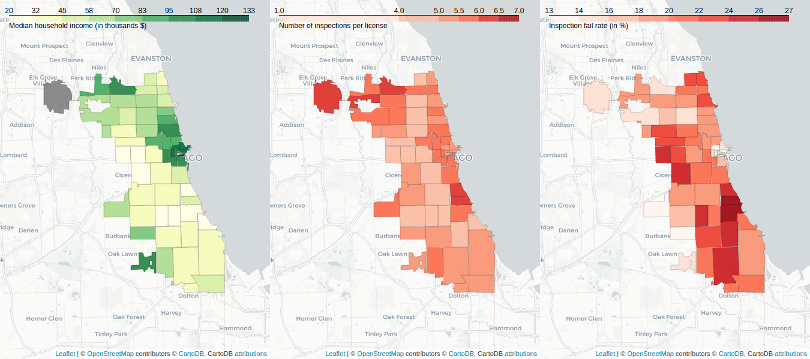

# Part Franchise versus Franchise #

## In which franchise should i go eat ?
Supposed that someone want to eat in a big franchise for some reason. One can say that maybe it's important to go in a safe place with little risk to contrat a disease or something. If we check the rate of fail inspections, we can have an idea of which franchise is the safest.
### Want to eat a beef burger?

If we're looking at McDonald's, Burger King and Wendys, we want to choose one of them to have a good american burger. The question is which one to choose? One can say that it depends on the people preference. Let's answer this question by looking at the safety of each restaurant without taking into account the taste of each burger. In function of the year, the safest restaurant varies but nowadays, Burger king is the winner. I addition, one note that since 2015, only Burger King try to perform better in comparison with Wendys and Mcdonald's those increase their fail rate.  

### Want to eat some fried chicken ?

By selecting KFC,Harold's Chicken and Popeyes, our chicago guy want to choose one of them for his dinner. He doesn't prefer any of them but he wants to be sure that the restaurant is safe because he read an article about [bird flu](http://dbfchicago.com/bird-flu-chicago/) that makes him scared of this disease. Like for the burgers, since 2015, KFC and Popeyes try to stabilize (decrease) their fail rate. In contrast, Harold's Chicken trend to fail more inspections for the two others. Base on that, the chicago guy will have to choose between the [Colonel Sanders](https://en.wikipedia.org/wiki/Colonel_Sanders) restaurant and Popeyes. 
### Want to eat some Pizza ?  

 
## Where do I need to go?  

Sometimes, we just don't want to go far away to enjoy a meal. We want to get out of bed, go outside and take a burger at the closest street block without worrying about transportation. We will see in this part that not all districts are equal regarding inspections and their results. Latter on, we will focus on some franchises as those also have pretty different results depending on where they are located in Chicage.  

### The socio-economic factor  

Chicago suffers a clear wealth divide with some district being largely poorer than teir neighboors. This can be observed with the North and North-East districts that are way richer than the West and South side of Chicago. We used the median household income as a wealth indicator to see if there is a correlation between the wealth and the overall restaurant inspections' results.  
To visualize this, we put side by side the districts' median income, their average inspections per restaurant (from 2011 to 2017) and the average inspection fail rate of these same restaurants.  

#### IMAGE INCOME->INSPECTION/LICENSE->FAILRATE  
We clearly see a domino effect between these different metrics. Especially, lower income districts' restaurants may face less inspections. And this lower amount of inspections leads surely to more failures as restaurants are left alone longer without control.  
