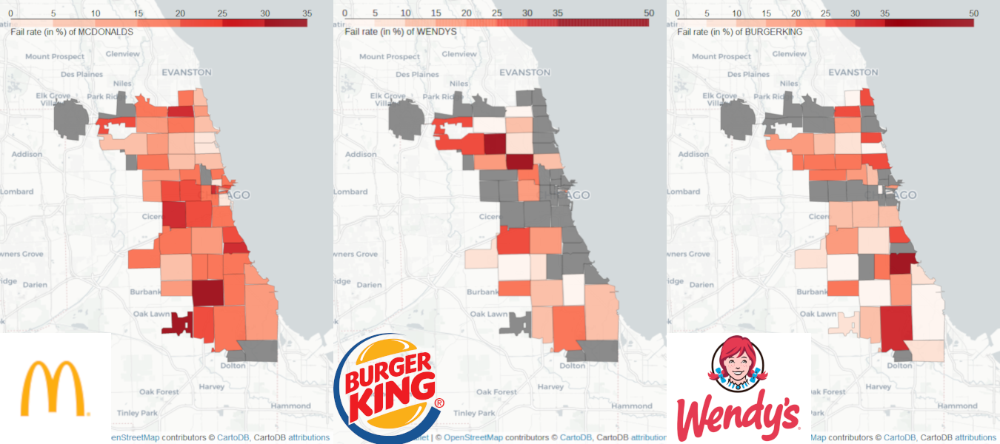
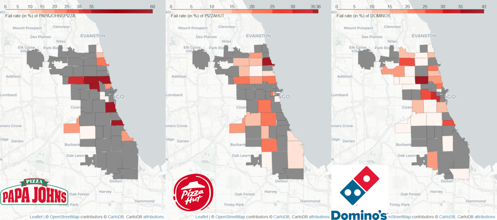
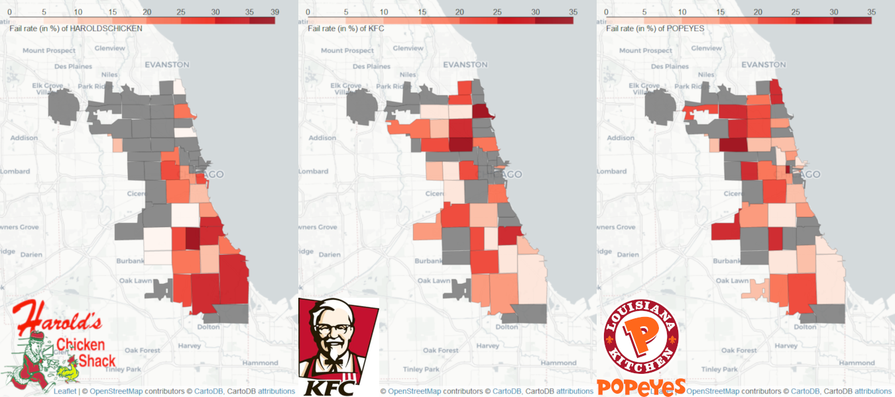
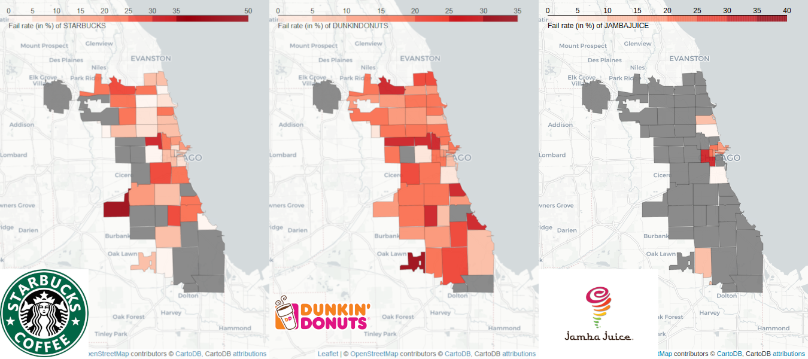
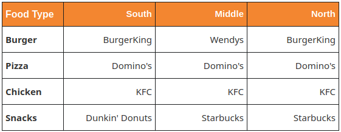

# Part Franchise versus Franchise #

## In which franchise should i go eat ?
Supposed that someone want to eat in a big franchise for some reason. One can say that maybe it's important to go in a safe place with little risk to contrat a disease or something. If we check the rate of fail inspections, we can have an idea of which franchise is the safest.
### Want to eat a beef burger?

If we're looking at McDonald's, Burger King and Wendys, we want to choose one of them to have a good american burger. The question is which one to choose? One can say that it depends on the people preference. Let's answer this question by looking at the safety of each restaurant without taking into account the taste of each burgers. In function of the year, the safest restaurant varies but nowadays, Burger king is the winner of this problem. 

### Want to eat some chicken ?

By selecting KFC,Harold's Chicken and Popeyes, our chicago guy want to choose on of them for his dinner. He doesn't prefer any of them he just wants to be sure that the restaurant is safe because he read an article about [bird flu](http://dbfchicago.com/bird-flu-chicago/) that makes him scared of this disease.
### Want to eat some Pizza ?  

 
## Where do I need to go?  

Sometimes, we just don't want to go far away to enjoy a meal. We want to get out of bed, go outside and take a burger at the closest street block without worrying about transportation. We will see in this part that not all districts are equal regarding inspections and their results. Latter on, we will focus on some franchises as those also have pretty different results depending on where they are located in Chicage.  

### The socio-economic factor  

Chicago suffers a clear wealth divide with some district being largely poorer than teir neighboors. This can be observed with the North and North-East districts that are way richer than the West and South side of Chicago. We used the median household income as a wealth indicator to see if there is a correlation between the wealth and the overall restaurant inspections' results.  
To visualize this, we put side by side the districts' median income, their average inspections per restaurant (from 2011 to 2017) and the average inspection fail rate of these same restaurants.  
   
  
   
We clearly see a domino effect between these different metrics. Especially, lower income districts' restaurants may face less inspections. And this lower amount of inspections leads surely to more failures as restaurants are left alone longer without control. So if you want to lunch in a random restaurant within your district with as few sanitization issues as possible, you better live in the wealthiest one!  

### But what if I  prefer <insert_food\> ? 

We got you covered! They are many franchises established in Chicago and all the biggest ones (such as McDonalds, Starbucks, KFC...) are present. But as we may expect, they all behave differently depending on where they are located. We will cover in this subsection which franchises are to be prefered depending on what type of food do you want and where do you want to eat it.  
We split up the franchises in 4 different categories depending on what type of food they are sellings: burgers, pizzas, fried chicken and snacks/drinks. Each categories only contains the 3 most established franchises as smaller ones tend to have not enough data for to study.  
 
#### I want: a Burger  
For the burger category, we have McDonalds, BurgerKing and Wendys facing themselves. McDonalds has a failing rate greater than 15% on almost all Chicago's territory but has no outliers (the biggest fail rate in only 35%). This differs from BurgerKing that is much less prone to failing inspections in the North and South of Chicago but has 2 districts in the Middle-North that are close to 50% failing rate. Wendys follows the same trend except the worst places in the south.  
 
  

#### I want: a Pizza  
Pizzas are a little bit different than other franchise types as they are also heavily involved in delivery. Papa Johns Pizza is the black sheep here with more than 25% failed inspections on about 60% of the districts it covers. Dominos and PizzaHut are the inverse of each others with Dominos being exemplary everywhere except in the middle of Chicago. PizzaHut is a little bit better on average in the Middle-North but worse than Dominos elsewhere.  
 
  

#### I want: Fried Chicken  
There is also a black sheep in fried chicken fast foods: Harold's Chicken Shack. While it covers the vast majority of South Chicago (the poorest region), most of the franchises are failing at least one quarter of the inspections. KFC and Popeyes have are doing well in the South but KFC has the advantage in the North.  
 
  

#### I want: a Snack  
One information that isn't shown in this part is the number of licenses Starbucks and Jamba Juice have in each district. They are both heavily invested in the touristic area of Chicago (the pier in the Middle-West) with as many as 30 stores in the tiniest district! They both are very careful in this location with fail rates lower than 15% on average. Starbucks is much better than Dunkin Donuts in the North and finally DD is the only one covering the South with unfortunately a pretty high fail rate.  
 
  
 
#### Conclusion
As a conclusion, we made a (simplified) table to recommend which franchises to go to depending on your location and food habits:  
 
  
